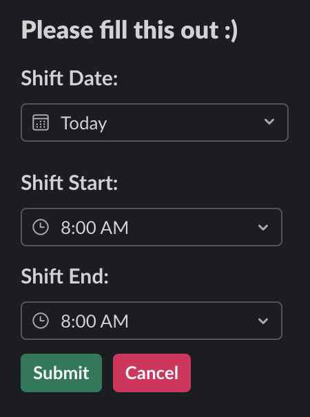
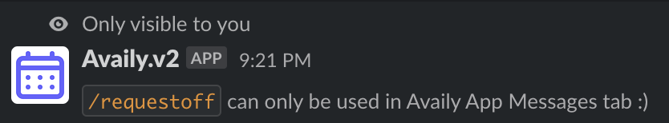
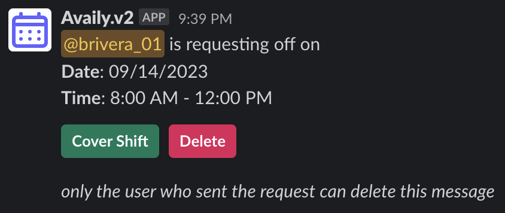
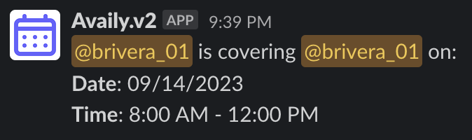
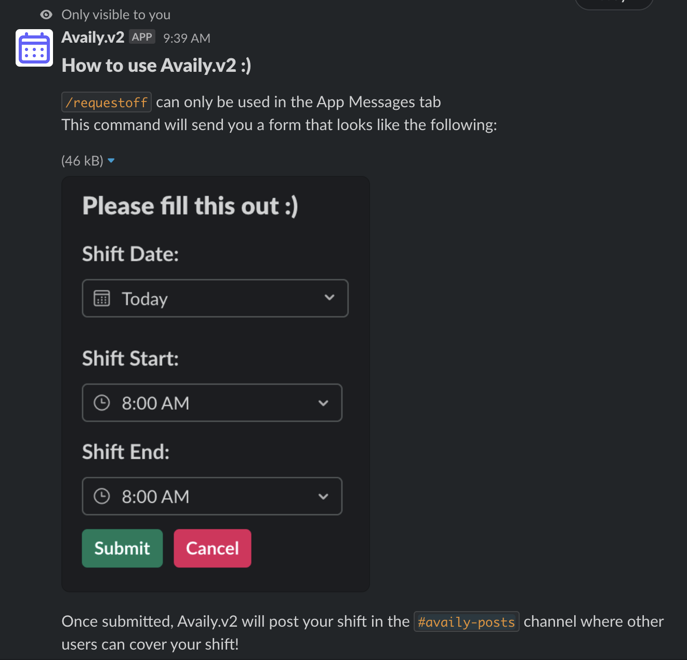

# Introduction

Availy.v2 is a slack app that allows users to request off shifts cover others' shifts. It was originally built using [bolt](https://slack.dev/bolt-js/tutorial/getting-started) and [mongoDB](https://www.mongodb.com/) hosted on [heroku](https://www.heroku.com/what). View the original repo [here](https://github.com/breyr/Availy-bot).

Availy.v2 is the superman brother to Availy (v1). The hosting process simplified using [this package](https://github.com/seratch/slack-cloudflare-workers). It is hosted on cloudflare [workers](https://workers.cloudflare.com/) utilizing cloudflare [kv storage](https://www.cloudflare.com/developer-platform/workers-kv/).

## How to use Availy.v2 :)

`/requestoff` can only be used in the App Messages tab\nThis command will send you a form that looks like the following:

If you use `/requestoff` in any other channel, it will send you a message saying that you can only use it in the App Messages tab.

### How to use the form:

Clicking on the date will open a calendar where you can select the date you want to request off. Clicking on the time will open a dropdown where you can select the time you want to request off. Clicking on the submit button will submit your request, post it to `availy-posts` channel, and update the form message saying that your request has been submitted.

### What happens when you hit submit?

Your request will be posted to the `availy-posts` channel. The message will look like this:

From here you (or someone else since this is your own message) can click on the `Cover Shift` button to take the shift. This will send a message to the person who requested off saying that you will take their shift. The message will look like this:

_Note: You will not be able to cover your own shift._

### What if I forget all of this? 😅

Don't worry! If you use `/tutorial` in any channel, it will send you a message that only you can see if you use the command not in the DM with Availy.v2. This includes a basic run down on how to submit a request. Here is an example:

#### That's it! Please feel free to email [me](mailto:breyr@gmail.com) if you experience any bugs :)

## How to install:

<!-- add to slack button -->

Use this button to add Availy.v2 to your slack workspace:

Once installed to your workspace, create a channel called `availy-posts` and add Availy.v2 to it. This is where all of the shift requests will be posted. Then you are all set! You can start using Availy.v2 by typing `/requestoff` in the App Messages tab.
